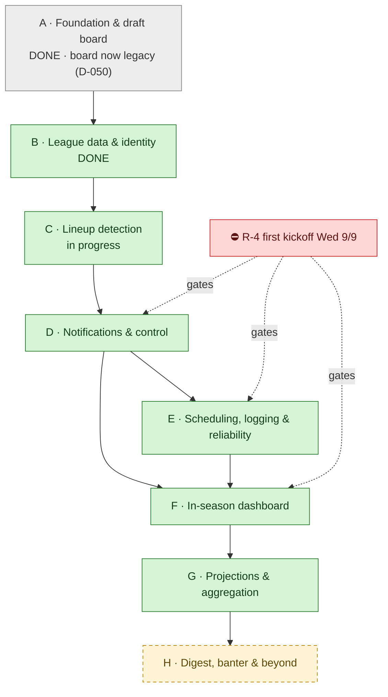

<!-- Generated/maintained by the `roadmap` skill. Edit via the skill to keep provenance + views consistent. -->
```yaml
# roadmap-config
milestone: V1
stages: [A, B, C, D, E, F, G, H]
tracks: [Alerts, UX, Data, Reliability, Setup]
id_scheme: stage-prefixed            # Stage A · Step A1 · Task A1.1
statuses: [Backlog, Next, In-progress, Blocked, Done, Hold]
priorities: [V1, V1-nice, Hold, "Won't-do"]
fields:
  required: [id, title, status, priority, provenance]
  optional: [target, depends_on, risk]
split_threshold: 8
```

# Fantasy Football Co-Coach — Roadmap & Planning Dashboard

> Single front door for "done / next / parked / blocking." Map here, detail in §9 links. Update §1 each session.

## 1. Status snapshot

| | |
|---|---|
| **Date** | 2026-09-03 |
| **Branch** | `docs-product-is-alerting` · PR: — (9 merged) |
| **Tests** | 606 Python + 87 JS, all green · CI gates both on every PR |
| **Phase** | **C 7/7, D 3/5, E 3/6, F 2/5.** Detection runs, delivers to a real phone (verified 2026-09-04), does not repeat itself, leaves a trace, and reports its own failure. The last piece that made it run without being asked is built; installing it waits on the iMac. The Week page is the front door. Next: the first real run after Monday's draft, then E6 (inactives sweep) and D4/F2 (per-alert control) |
| **V1 goal** | ✅ *A tool I actually want to use: I can see my team's situation at a glance, control what notifies me, trust the alerts I get, and diagnose it when it misbehaves.* |
| **Biggest blocker** | [R-4](#7-roadblocks) — **first Week 1 kickoff is Wed 2026-09-09 20:20 ET** and nothing in D/E/F exists. R-1 is closed. |

> **2026-09-03 changed what this project is.** The user: *"I do not need this application to
> help me with the draft in any way."* Stage A's draft board was scaffolding built while the
> league invite was outstanding — it is not the product and is not wanted (**D-050**). The
> product is in-season alerting, and the only date that matters now is the first kickoff.
> The league also went live the same day: ID `1076479097`, cookies supplied, parser verified
> against real ESPN with **zero diagnostics** (**R-1 closed**, **Q-2 answered**).

> **Note on the goal.** It is deliberately *not* "never miss a lineup fix." Lineup fixes matter but are
> not life-and-death; **user experience, notification control, and logging are first-class V1
> requirements**, not polish. This reordered the plan — the dashboard and notification control moved up
> from late phases, and observability moved up sharply from near-absent.

## 2. How this board works

Idea → tag in **§5** → fork? open **§6** decision → gates work? log **§7** roadblock → imminent? drill the Step to Tasks in `docs/roadmap/<stage>.md`.

- **Priority:** 🟢 V1 · 🔵 V1-nice · 🟡 Hold · ⚪ Won't-do.
- **Status:** Backlog → Next → In-progress → Blocked → Done (+ Hold).
- **Provenance (mandatory):** ✅ User-confirmed *(date)* · 🤖 Claude-proposed. No step runs without ≥1 ✅.
- **Hierarchy:** Stage `A` → Step `A1` → Task `A1.1` (tasks only for imminent work).
- **Ask for views:** "what needs my sign-off?", "V1 not-done", "what's blocked & why", "stage rollup", "critical path".

## 3. The workflow (mind-map)

### 3.1 Stage summary

**Legend:** 🟩 ✅ confirmed · 🟨 🤖 proposed · 🟥 ⛔ roadblock · ⬜ 🟡 hold.

### 3.2 Master plan — all steps

```mermaid
flowchart LR
    classDef confirmed fill:#d6f5d6,stroke:#2e7d32,color:#143d17;
    classDef proposed fill:#fff4d6,stroke:#b8860b,stroke-dasharray:5 4,color:#5b4708;
    classDef block fill:#ffd6d6,stroke:#c62828,color:#5b1414;
    classDef hold fill:#ededed,stroke:#888,color:#333;

    subgraph SA["A · Foundation"]
        direction TB
        A1["A1 config + cache"]:::confirmed
        A2["A2 ADP + player sources<br/>(board-only)"]:::hold
        A3["A3 draft board UI<br/>LEGACY"]:::hold
        A4["A4 CI"]:::confirmed
    end
    subgraph SB["B · League data"]
        direction TB
        B1["B1 ESPN adapter"]:::confirmed
        B2["B2 My League page"]:::confirmed
        B3["B3 identity crosswalk"]:::confirmed
        B4["B4 NFL schedule"]:::confirmed
    end
    subgraph SC["C · Lineup detection"]
        direction TB
        C1["C1 bye/OUT/IR advisor"]:::confirmed
        C2["C2 empty-slot defect"]:::confirmed
        C3["C3 week from ESPN"]:::confirmed
        C4["C4 action deadlines"]:::confirmed
        C5["C5 lineup-lock setting"]:::confirmed
    end
    subgraph SD["D · Notifications"]
        direction TB
        D1["D1 Notifier + ntfy<br/>DONE"]:::confirmed
        D2["D2 message rendering"]:::confirmed
        D3["D3 quiet hours + 2-strike<br/>DONE"]:::confirmed
        D4["D4 alert control config"]:::confirmed
        D5["D5 channel bake-off"]:::confirmed
    end
    subgraph SE["E · Reliability"]
        direction TB
        E1["E1 structured logging<br/>DONE"]:::confirmed
        E2["E2 launchd install<br/>DONE"]:::confirmed
        E3["E3 dead-man switch<br/>DONE"]:::confirmed
        E4["E4 delivery failure"]:::confirmed
        E5["E5 ffcoach init"]:::confirmed
        E6["E6 inactives sweep"]:::confirmed
    end
    subgraph SF["F · Dashboard"]
        direction TB
        F0["F0 ffcoach serve<br/>DONE"]:::confirmed
        F1["F1 week page<br/>DONE · landing page"]:::confirmed
        F2["F2 notification control UI"]:::confirmed
        F3["F3 source refresh panel"]:::confirmed
        F4["F4 alert history view"]:::proposed
    end
    subgraph SG["G · Projections"]
        direction TB
        G1["G1 ESPN + Sleeper"]:::confirmed
        G2["G2 aggregation"]:::confirmed
        G3["G3 decision log"]:::confirmed
        G4["G4 bench upgrades"]:::confirmed
        G5["G5 model/scoring.py"]:::proposed
    end
    subgraph SH["H · Later"]
        direction TB
        H1["H1 digest + banter"]:::confirmed
        H2["H2 playoffs + elimination"]:::confirmed
        H3["H3 waivers"]:::proposed
        H4["H4 league intel"]:::proposed
        H5["H5 Vegas context"]:::hold
        H6["H6 multi-league"]:::hold
    end

    SA --> SB --> SC --> SD --> SE --> SF --> SG --> SH
    C3 -. gates .-> C4
    B4 -. gates .-> C1
    G2 -. gates .-> G4

    F0 -. gates .-> F2
```



### 3.3 Step registry

> Steps only — tasks live in stage docs. Confirming flips Provenance ✅ here **and** recolors 3.2.

| ID | Step | Status | Priority | Target | Depends-on | Risk | Key decisions / questions | Provenance |
|---|---|---|---|---|---|---|---|---|
| A1 | League config + SQLite cache | Done | 🟢 V1 | — | — | L | D-001 | ✅ 2026-08-20 |
| A2 | FFC ADP + Sleeper player sources | Done | 🟡 Hold | — | A1 | L | D-002, **D-050** | ✅ 2026-08-20 |
| A3 | Draft board page + explain mode — **legacy** | Done | 🟡 Hold | — | A2 | L | D-003, D-004, **D-050**, D-052 | ✅ 2026-08-20 |
| A4 | GitHub Actions CI | Done | 🟢 V1 | — | — | L | — | ✅ 2026-08-28 |
| B1 | ESPN league adapter (cookie auth) | Done | 🟢 V1 | — | A1 | **H** | D-005, D-006 | ✅ 2026-08-28 |
| B2 | My League page + shared nav | Done | 🟢 V1 | — | B1 | L | D-007 | ✅ 2026-08-28 |
| B3 | Player identity crosswalk | Done | 🟢 V1 | — | A2 | M | D-008 | ✅ 2026-08-28 |
| B4 | NFL schedule (byes + kickoffs) | Done | 🟢 V1 | — | — | L | D-009 | ✅ 2026-08-29 |
| C1 | Lineup advisor: bye / OUT / IR | Done | 🟢 V1 | — | B1, B4 | L | D-010, D-011 | ✅ 2026-08-29 |
| C2 | Empty-slot detection | Done | 🟢 V1 | — | C1 | **H** | D-012 | ✅ 2026-08-29 |
| C3 | Current week from ESPN `scoringPeriodId` | Done | 🟢 V1 | — | B1 | M | D-013 | ✅ 2026-08-29 |
| C4 | Action-deadline alerting + bye look-ahead | Done | 🟢 V1 | — | C3 | M | D-014 | ✅ 2026-08-29 |
| C5 | Read lineup-lock league setting | Done | 🟢 V1 | — | B1 | M | D-015 | ✅ 2026-08-29 |
| C6 | **Truth repairs from the 2026-08-31 review** | Done | 🟢 V1 | — | C5 | M | D-044…D-048 | ✅ 2026-08-31 |
| C7 | **`CheckResult` + `ffcoach check`** | Done | 🟢 V1 | — | C6 | **H** | D-049, **D-054** | ✅ 2026-09-03 |
| D1 | `Notifier` interface + **ntfy** | Done | 🟢 V1 | — | C7 | M | D-016, D-042, **D-057, D-058** | ✅ 2026-09-03 |
| D2 | Message rendering (~~160-char SMS budget~~) | Done | 🟢 V1 | — | D1 | L | D-017, **D-059** | ✅ 2026-09-03 |
| D3 | Quiet hours + two-strike repeat policy | Done | 🟢 V1 | — | D1 | M | D-018, D-019, D-057, **D-060, D-061** | ✅ 2026-09-03 |
| D4 | Per-alert enable / tier / threshold config | Backlog | 🟢 V1 | Week 1 | D1 | L | D-020 | ✅ 2026-08-29 |
| D5 | Channel bake-off — `ffcoach notify --test` shipped with D1 | Backlog | 🔵 V1-nice | — | D1 | L | D-042 | ✅ 2026-08-29 |
| E1 | **Structured run logging** (JSONL + SQLite history) | Done | 🟢 V1 | — | D1 | M | D-021, D-041, **D-062** | ✅ 2026-09-04 |
| E2 | `launchd` install (`ffcoach schedule`) | Done | 🟢 V1 | — | D1, E1 | **H** | D-022, **D-064** | ✅ 2026-09-04 |
| E3 | Dead-man's switch (on-host **and** off-host) | Done | 🟢 V1 | — | E1 | M | D-023, R-3, **D-063** | ✅ 2026-09-04 |
| E4 | Delivery-failure detection + fallback | Backlog | 🟢 V1 | Week 1 | D1, E1 | M | D-024 | ✅ 2026-08-29 |
| E5 | `ffcoach init` + hardened `doctor` — **`notify --init` shipped** | Backlog | 🟢 V1 | Week 1 | D4 | M | D-025 | ✅ 2026-08-29 |
| E6 | Inactives sweep (~90m pre-kickoff) | Backlog | 🟢 V1 | Week 1 | E2 | M | D-026 | ✅ 2026-08-29 |
| F0 | **`ffcoach serve` — local web server** | Done | 🟢 V1 | — | — | L | D-040, **D-071** | ✅ 2026-09-04 |
| F1 | Week dashboard — **is the landing page** | Done | 🟢 V1 | — | C4 | M | D-027, D-028, D-051, **D-066** | ✅ 2026-09-04 |
| F2 | Notification control UI (writes config) | Backlog | 🟢 V1 | — | D4, F0 | M | D-020, D-040 | ✅ 2026-08-29 |
| F3 | Data-source refresh / health panel | Backlog | 🟢 V1 | — | E1, F0 | L | D-029 | ✅ 2026-08-29 |
| F4 | Alert history view | Backlog | 🔵 V1-nice | — | E1, F0 | L | — | 🤖 |
| G1 | ESPN + Sleeper projection sources (**two, not three**) | Backlog | 🔵 V1-nice | — | B3 | M | D-030, D-043 | ✅ 2026-08-29 |
| G2 | Aggregation + accuracy weighting | Backlog | 🔵 V1-nice | — | G1 | M | D-030 | ✅ 2026-08-29 |
| G3 | Decision log (projection + outcome) | Backlog | 🔵 V1-nice | — | G1 | M | D-031 | ✅ 2026-08-29 |
| G4 | Bench-upgrade alerts | Backlog | 🔵 V1-nice | — | G2 | M | D-032 | ✅ 2026-08-29 |
| G5 | `model/scoring.py` (custom scoring) | Backlog | 🟡 Hold | — | — | L | Q-2 **closed** | ✅ 2026-09-03 |
| H1 | Tuesday digest + smack talk | Backlog | 🔵 V1-nice | — | D1 | L | D-033, D-034 | ✅ 2026-08-29 |
| H2 | Playoff weeks + elimination awareness | Backlog | 🔵 V1-nice | — | C3 | L | D-035 | ✅ 2026-08-29 |
| H3 | Waiver wire | Backlog | 🟡 Hold | — | G2 | M | — | ✅ 2026-08-29 |
| H4 | League-wide intelligence | Backlog | 🟡 Hold | — | B1 | M | D-036 | ✅ 2026-08-29 |
| H5 | Vegas game context | Hold | 🟡 Hold | Sept 2026 | — | M | D-037, Q-3 | ✅ 2026-08-29 |
| H6 | Multi-league support | Hold | 🟡 Hold | — | — | L | D-038 | ✅ 2026-08-29 |

**Stage rollup:** A 4/4 (100%) · B 4/4 (100%) · C 7/7 (100%) · D 3/5 (60%) · E 3/6 (50%) · F 2/5 (40%) · G 0/5 · H 0/6.
**Overall:** 23/42 steps done (55%).

> **On that percentage — it is now worse than it looks, twice over.** The 2026-08-31 review's
> sharpest line was that it overstates user value, because until C7 lands the finished lineup
> detection had no production caller. **C7 closed that on 2026-09-03** — `ffcoach check`
> composes it and exits with a status code — so the discount that mattered most is gone;
> D1 and D2 followed the same day, so the result now reaches a phone. What is
> still missing is everything that makes it *run without being asked*: D3's repeat
> policy, then E1's logging and E2's scheduling. **D-050 adds the second discount.** Three of Stage A's four steps
> (A2, A3, and most of the report layer feeding `board.json`) serve a draft board the user
> has said he does not want. Counting them as V1 progress inflates a number that was already
> measuring code written rather than anything runnable. Left un-reweighted so the history
> stays readable, with the caveat stated here instead.

## 4. Done ledger

| Shipped | Detail |
|---|---|
| **Draft board** (PR #1, #2) | Tiers, ADP value, availability-at-next-pick, explain mode, live localStorage recompute. |
| **ESPN league adapter** (PR #3) | Cookie auth, cache, `EspnAuthError`. Parser **still unverified against a live league** — see R-1. |
| **My League page** (PR #3) | Teams, records, rosters, starters vs bench. Shared `web/nav.js` so new sections cost one entry. |
| **CI** (PR #3) | `pytest` + `node --test` on every PR. Nothing gated builds before this. |
| **Identity crosswalk** (PR #4) | 240/240 draftable players carry ESPN/MFL/GSIS ids. Absorbed the `"NA"` sentinel and `merge_name` alias traps. |
| **NFL schedule** | Byes derived (32/32 teams), 6 lock windows/week measured. Caught the `LA`/`LAR` + `WAS`/`WSH` mismatch that would have silently killed bye alerts for two teams. |
| **Lineup advisor** | Bye/OUT/IR detection with eligible-replacement naming. QUESTIONABLE deliberately excluded. |
| **Action deadlines** (C4) | Deadline follows the available fix, not kickoff. Waiver timing read from ESPN (six days/wk at 11:00 — the Wednesday assumption was wrong). Bye look-ahead flags next week's uncovered byes while claims still help. |
| **Week resolution** (C3) | ESPN `scoringPeriodId` is authoritative and short-circuits before any schedule fetch; derivation is fallback-only and self-labels. Refuses rather than defaulting when neither is available. |
| **Truth repairs** (PR #8) | `SourceResult` + parse-before-cache (D-044); `FixPlan` kinds replacing the deadline clamp (D-046); joint replacement allocation (D-045); `UNKNOWN` + diagnostics over plausible defaults (D-047); tri-state schedule status (D-048). |
| **Board honesty + freshness** (PR #9) | Removed the bargain/reach verdict — `rank` came from the ADP sort, so `adp - rank` graded ADP against itself (D-052). Fixed the freshness fold: a lookup table's age no longer ages the page (D-053). |
| **Live league connected** (2026-09-03) | League `1076479097`, cookies supplied, `ffcoach league` green with **zero diagnostics**. Real settings: 12 teams, full PPR, QB1/RB2/WR2/TE1/FLEX1/K1/DEF1/BN7/IR1, waivers 6 days a week at 11:00 with no budget, lock `INDIVIDUAL_GAME`. Closes R-1 and Q-2. |
| **Empty-slot detection** (C2) | Closed a correctness hole: an empty starting slot had no roster entry to iterate, so the most elementary lineup failure was invisible. Slot counts come from ESPN `lineupSlotCounts`. Fixture proof: 1 finding before, 6 after. |

## 5. Feature / work backlog

> Steps live in §3.3. This holds ideas not yet promoted to Steps.

| ID | Item | Why / angle | Priority | Track | Status | Provenance |
|---|---|---|---|---|---|---|
| X-1 | IR-slot management prompts | Moving an IR-eligible player to IR frees a bench spot — a real move nobody surfaces | 🔵 V1-nice | Alerts | Backlog | 🤖 |
| X-2 | Trade-deadline reminder | Fixed league date; easy to forget | 🔵 V1-nice | Alerts | Backlog | 🤖 |
| X-3 | Drop-candidate naming on waiver advice | "Claim Pittman" is incomplete when the roster is full | 🔵 V1-nice | Alerts | Backlog | ✅ 2026-08-29 |
| X-4 | Side-by-side player comparison | Table stakes in competing tools; cheap once projections exist | 🔵 V1-nice | UX | Backlog | 🤖 |
| X-5 | Accuracy-weighted source ranking display | Show *which* source has been right this season | 🔵 V1-nice | UX | Backlog | 🤖 |
| X-6 | Remove `clangd-lsp` plugin | C/C++ language server, irrelevant to this Python/JS repo | ⚪ Won't-do | — | Backlog | 🤖 |

## 6. Decision Log

### Decided

- **D-001 — Deterministic Python core + Claude skill.** ✅ *(2026-08-20)*. "Same every time = script; needs judgment = skill." Advisors emit structured findings, never prose.
- **D-002 — Free data only.** ✅ *(2026-08-20)*. No paid projection feeds, ever.
- **D-003 — Never rename standard terminology.** ✅ *(2026-08-20)*. Interface says "ADP", not "Typical pick". Terms are annotated, never replaced. Enforced by tests.
- **D-004 — Explain mode annotates only.** ✅ *(2026-08-20)*. Toggling never changes layout or ordering.
- **D-005 — Platform is ESPN, permanently.** ✅ *(2026-08-28)*. No other platform will be supported.
- **D-006 — Keep `LeagueAdapter` despite one implementation.** ✅ *(2026-08-29)*. Justified as the test seam for injecting fixture rosters without HTTP — *not* platform flexibility.
- **D-007 — Shared nav from one `PAGES` list.** ✅ *(2026-08-28)*. New sections cost one entry, not per-page markup.
- **D-008 — Resolve identity by ID before matching.** ✅ *(2026-08-28)*. Name matching already failed twice (accents, nicknames).
- **D-009 — Alerts time off per-player kickoff, not a weekly sweep.** ✅ *(2026-08-29)*. Measured: 6 distinct lock windows in Week 8.
- **D-010 — QUESTIONABLE/DOUBTFUL are not "out".** ✅ *(2026-08-29)*. Uncertain; handled by the inactives sweep instead.
- **D-011 — Locked findings are reported, never dropped.** ✅ *(2026-08-29)*. Silently discarding makes a missed player look like a clean lineup.
- **D-012 — Empty slots carry the same severity as OUT.** ✅ *(2026-08-29)*.
- **D-013 — Week comes from ESPN `scoringPeriodId`.** ✅ *(2026-08-29)*. Computing it means owning the rollover moment; a rollover bug alerts about the wrong week entirely.
- **D-014 — Alert on the earliest deadline that permits the fix.** ✅ *(2026-08-29)*. No bench replacement ⇒ needs a waiver claim ⇒ Tuesday deadline, not Sunday kickoff.
- **D-015 — Read the lineup-lock setting rather than assume per-player.** ✅ *(2026-08-29)*.
- **D-016 — Two tiers: interrupt (push/SMS) vs digest (email).** ✅ *(2026-08-29)*. Zero interrupts in a clean week is the system working.
- **D-017 — Batched per lock window, with reasons, under 160 chars.** ✅ *(2026-08-29)*.
- **D-018 — Quiet hours 23:00–08:00 ET, deferred not dropped.** ✅ *(2026-08-29)*.
- **D-019 — Two-strike repeat policy; the roster is the acknowledgment.** ✅ *(2026-08-29)*. No inbound channel needed — a fixed problem stops being a finding on its own.
- **D-020 — Notifications must be user-controllable.** ✅ *(2026-08-29)*. Per-alert enable/tier/threshold, editable from the UI. A V1 requirement, not polish.
- **D-021 — Logging is a V1 requirement.** ✅ *(2026-08-29)*. Needed to diagnose failures; was near-absent in the original design.
- **D-022 — `launchd`, not `cron`.** ✅ *(2026-08-29)*. cron does not run missed jobs on a sleeping Mac — it would appear to work and fail silently on the mornings that matter.
- **D-023 — Dead-man's switch.** ✅ *(2026-08-29)*. Expired cookies produce no alert, indistinguishable from "nothing wrong."
- **D-024 — Delivery failure is distinct from check failure.** ✅ *(2026-08-29)*.
- **D-025 — Must be clonable by someone else.** ✅ *(2026-08-29)*. `ffcoach init` + hardened `doctor`; no personal data in the repo.
- **D-026 — Inactives sweep ~90m before kickoff.** ✅ *(2026-08-29)*. The highest-value alert: a Questionable starter ruled out while you're at brunch.
- **D-027 — Action queue on top, matchup as a persistent strip.** ✅ *(2026-08-29)*. Chosen from browser mockups.
- **D-028 — No automated lineup changes.** ✅ *(2026-08-29)*. ESPN has no write API; reverse-engineering one risks the account to save two taps. Text instructions + collapsible ESPN how-to.
- **D-029 — Rounded scores with the source named.** ✅ *(2026-08-29)*. Decimals imply precision ESPN's projections lack.
- **D-030 — Aggregate 3+ projection sources, weighted by accuracy.** ✅ *(2026-08-29)*. 12-season study: aggregation beat every individual source in 69% of comparisons; ESPN now ranks last.
- **D-031 — Full decision log (source accuracy + own decisions).** ✅ *(2026-08-29)*.
- **D-032 — Bench upgrades never interrupt by default; gated behind aggregation.** ✅ *(2026-08-29)*. A wolf-crying channel is the same channel carrying "your starter is on bye."
- **D-033 — Banter as written, copy-paste-ready lines.** ✅ *(2026-08-29)*.
- **D-034 — Banter targets decisions and outcomes, never people.** ✅ *(2026-08-29)*.
- **D-035 — Playoffs: flag Week 18 resting + elimination awareness.** ✅ *(2026-08-29)*.
- **D-036 — League intel deferred, not rejected.** ✅ *(2026-08-29)*. Highest differentiation available; revisit after alerts are proven.
- **D-037 — Vegas context parked until the season starts.** ✅ *(2026-08-29)*. See Q-3 for the exact re-check.
- **D-038 — One league now; don't hardcode against a second.** ✅ *(2026-08-29)*.
- **D-039 — Feature branches + PRs into `main`, never direct merge.** ✅ *(2026-08-28)*.
- **D-040 — `ffcoach serve`: a small local web server.** ✅ *(2026-08-29)*. Python stdlib only, localhost, no new dependency. Two things forced it: requiring VS Code Live Server is real friction for a tool checked weekly, and **notification control (F2) is impossible as static HTML** — a page cannot write your config file. Replaces the Live Server workflow.
- **D-041 — Logging is structured JSONL plus SQLite history.** ✅ *(2026-08-29)*. Every run appends a JSON line (checked / found / sent / failed); alert and decision history go in the existing SQLite cache. Greppable at 9am on a Sunday, queryable by the UI history view, and one storage decision covers both E1 and G3.
- **D-042 — ntfy is the first channel built.** ✅ *(2026-08-29)*. Closes Q-1. No credentials, no carrier dependency, no length ceiling — the fastest path to a working alert. Email and SMS gateway remain behind the same interface for later; the bake-off (D5) drops to V1-nice.
- **D-043 — Ship two projection sources, add a third later.** ✅ *(2026-08-29)*. Closes Q-5. ESPN and Sleeper are both confirmed free and unauthenticated, and a two-source average already beats either alone. Unblocks G1/G2 now instead of waiting on nflverse-derived modeling work.
- **D-044 — Sources return `SourceResult`, and parse before they cache.** ✅ *(2026-08-31)*. From the review. Bare text made a live fetch and a week-old cache indistinguishable, and caching a raw 200 before validating it let an ESPN login page evict the last usable roster. Freshness now travels with the value (the `WeekResolution` / `LineupLock` idiom applied a third time), and `freshest()` reports a page's age as its *oldest* input. **Amends the source template in CLAUDE.md.**
- **D-045 — Replacements are allocated across the roster, not chosen per slot.** ✅ *(2026-08-31)*. From the review, confirming a suspicion already recorded in `CODEX_README.md`. `advisors/roster_plan.py` serves the most-constrained opening first so a dedicated RB slot is not stripped by FLEX. IR is a prerequisite action, not a bench swap — ESPN will not start a player out of an IR slot.
- **D-046 — Deadlines carry a fix *kind*, not just a time. Partially overturns D-014's implementation.** ✅ *(2026-08-31)*. The review is right and the C5 clamp was wrong. `min(waiver, lock)` stopped the number from printing after the lock but kept saying "claim someone", producing a plausible time attached to an impossible action. `FixPlan` names the action (`BENCH_SWAP` / `WAIVER_CLAIM` / `ADD_BEFORE_LOCK` / `UNKNOWN`) with a one-word verb. **D-014's principle stands** — the deadline belongs to the available fix — only the clamp is replaced. Deliberately no `FREE_AGENT_ADD`: nothing fetches the free-agent pool, and an unemittable kind is a lie.
- **D-047 — An unusable value becomes `UNKNOWN` plus a diagnostic; a plausible default is never substituted.** ✅ *(2026-08-31)*. From the review. Unknown ESPN slot ids defaulted to `BN` (hiding a real starter from every check) and unknown pro teams to `FA` (matching no schedule row, so he looked safe). Both produced a clean run and an unguarded lineup. Diagnostics travel on `League.diagnostics` into the payload and onto the page, because a warning only on stderr of an unattended run is not a warning.
- **D-048 — Missing schedule data is `unknown`, never `bye`.** ✅ *(2026-08-31)*. From the review, then widened. A row with a blank kickoff time was dropped, after which "no row" meant bye — a TBD game became the most certain fact the product emits. `Schedule.status()` is now tri-state, **and** a bye additionally requires being the team's *single* missing week, so a truncated download cannot manufacture a run of byes. That second half is not in the review; the same defect generalizes past the case it found.
- **D-049 — Compose detection into a `CheckResult` before building delivery (C7).** ✅ *(2026-08-31)*. From the review, accepted in narrow form. `find_problems()` has no production caller, so there is currently nothing for a notifier to send and no place orchestration lives except inside a delivery module. C7 adds that object and `ffcoach check --dry-run`. **Not accepted:** the review's broader reordering of D/E/F around it — see the reply document for why the evidence does not carry that far.

- **D-050 — The draft board is legacy scaffolding, not the product.** ✅ *(2026-09-03)*. The user, unprompted: *"I do not need this application to help me with the draft in any way."* Stage A was built during R-1 because it was the only thing buildable without a league. It is not deleted — deleting `advisors/draft.py`, `model/value.py`, `model/tiers.py`, `sources/ffcalc.py` and their tests is roughly a third of the suite and a day this week does not have — but it is **Hold**, it earns no further work, and no planning document may present it as V1 progress. *Affects: A2, A3, F1, the §3.3 rollup.*
- **D-051 — The Week page becomes the landing page.** ✅ *(2026-09-03)*. Follows D-050: `web/index.html` is currently the draft board, so the app's front door is the one page the user does not want. F1 takes the index; the board moves to its own path and stays in the nav. *Affects: F1, D-040.*
- **D-052 — The board states no bargain/reach verdict.** ✅ *(2026-09-03)*. `build_board` sorted by ADP and set `rank` from that sort, then graded `adp - rank` — ADP against itself. The number measured the gap between a continuous scale and a dense integer index and grew with depth: a DEF at ADP 195.9 landed on row 271, scored −75.1, and was labelled "reach". Grading market price needs an independent ranking and there is no projection model. `availability` (a normal CDF over FFC's `stdev`) is real and stays. Superseded in importance by D-050 the same day, but the deletion stands on its own: it removed advice that was wrong.
- **D-053 — A lookup table's age does not age the page. Amends D-044.** ✅ *(2026-09-03)*. Found by the first real run. The crosswalk's TTL is seven days (identity changes slowly); ADP's is six hours (it moves hourly in draft season). `freshest()` took the oldest of both, so a board whose every number was two minutes old announced **"data 6d old"**. Taking the oldest input is right when inputs are comparable; a join table is not — nothing on the page comes from it, it only binds ids. `freshest(*results, lookups=())`: a lookup's *age* is exempt, its *stale* flag is not, because past its TTL a wrong bind puts the wrong player's bye week on the page. A banner that cries stale on a live page is the same trust failure D-044 exists to prevent, arriving from the other side.
- **D-042 — reconfirmed.** ✅ *(2026-09-03)*. Asked again now that delivery is imminent; the user chose a phone push app (ntfy or Pushover) over email and webhooks. One HTTP POST, no carrier, no SMTP, no OAuth, and it reaches him away from the Mac — which matters because of R-3.

- **D-054 — An all-clear requires that every check actually ran.** ✅ *(2026-09-03)*. C7's core idea, and it did not come from the plan. A check that finds nothing is not a check that found nothing wrong: without `lineupSlotCounts` the empty-slot check never runs, and an empty starting slot produces the same empty list as a healthy roster. A stale cached roster, a derived week, and an unrecognized slot id all fail the same way. So `CheckResult.blind_spots` records what stopped the run from seeing everything, and `all_clear` needs **both** no findings and no blind spots. Three states — `problems` / `unverified` / `all_clear` — which map directly onto interrupt / say-so / stay-silent. This is `D-047`'s rule ("absence is not evidence") applied one level up, to the run rather than to a field.
- **D-055 — Before the draft, an empty roster is not a lineup problem.** ✅ *(2026-09-03)*. Found by running C7 against the live league four days before the draft: **nine** confident "claim someone by Friday" findings, one per empty starting slot, for a roster the draft would fill on Monday. Nine wrong alerts on the first night is how a channel becomes something you mute. ESPN publishes `draftDetail.drafted`; the checks skip when it is `False`, giving a fourth status `pre_draft`. Tested with `is False` and not truthiness: an absent field is `None`, and treating absence as "not drafted" would mute every alert for a season the first time ESPN renamed the field.
- **D-056 — No `--dry-run` until there is a send to skip.** ✅ *(2026-09-03)*. C7's plan named the flag. Nothing is delivered or written yet, so it would suppress nothing — the same broken promise as an unemittable `FixKind` (D-046). It arrives with D1. `--now` carries the offline-testing weight instead, and **refuses a naive instant** rather than reading it as UTC and shifting every deadline by hours.

- **D-057 — A blind spot never sends an alert on its own.** ✅ *(2026-09-03)*. `CheckResult.blind_spots` (D-054) is exactly the kind of thing that feels like it should notify, and must not — yet. A stale ESPN fetch persists across *every* run of a day, so until D3's two-strike repeat policy exists, sending on blind spots alone is a spam machine, and a channel you mute is strictly worse than one that is occasionally quiet. Blind spots ride *inside* a message that was going out anyway, so if you are being told something you also learn what was uncertain. **This is why D3 must land before E2:** the moment a scheduler runs the check unattended, "sends once per problem" stops being true and starts being "sends every fifteen minutes". *Affects: D3, E2.*
- **D-058 — The ntfy topic name is a credential.** ✅ *(2026-09-03)*. A public ntfy topic has no authentication of any kind: whoever knows the name can read your alerts and publish to them. So `notify.yaml` is gitignored like `espn.yaml`, obvious names (`ffcoach`, `fantasy`, `test`, `alerts`) are refused at load rather than merely discouraged, `doctor` reports that a channel is configured and never which topic, and `DeliveryError` messages omit it — an error string is the thing most likely to be pasted into an issue.
- **D-059 — The 160-character budget is retired, and ntfy is published as JSON.** ✅ *(2026-09-03)*. D-017's budget existed for an SMS gateway that D-042 deferred; ntfy has no length ceiling, so messages name the replacement inline and the fix needs no second screen. Long lists truncate at five with an exact count and a pointer, so nothing is hidden. Separately: publishing as `{server}/{topic}` with a `Title:` header **does not work** — HTTP headers are ASCII and every generated title contains an em dash, so it raises `UnicodeEncodeError` before sending. JSON to the server root is UTF-8. Caught by a test rather than by the first alert of the season.

- **D-060 — The second strike is spent late, and needs air after the first.** ✅ *(2026-09-03)*. D-019 said "two strikes" and left *when* open. Spending strike two on the next scheduler run is a reminder fifteen minutes after the first — pure noise. It waits for a three-hour last-call window before the deadline, which is the single most useful message this tool sends. A second constant was **found by a test, not by reasoning**: without a 45-minute minimum gap, a problem first *seen* inside the last-call window burns both strikes in one scheduler cycle and then goes silent for the three hours that mattered. Quiet hours get the mirror-image exception: they yield to a deadline that falls inside them, because holding past the last actionable moment produces silence indistinguishable from a clean week. *Affects: D3, E2, E6.*
- **D-061 — Decide, send, then record; and the history clock is the check's clock.** ✅ *(2026-09-03)*. Three orderings that all fail the same way — by spending a strike on a message nobody received. Recording before sending loses strike two, the one that lands ninety minutes before kickoff; a failed delivery therefore records nothing and the next run retries. A `--dry-run` records nothing, because it delivered nothing. And `AlertHistory` takes the *check's* clock rather than `time.time()`: with `--now` they differ, so every "how long since the last alert" comparison would be between a simulated instant and a real one — wrong wherever the flag is used and invisible in production where the two agree. Found by running a six-run simulation, not by a unit test. Alert history also lives in its own `alerts` table rather than through `Cache`: a TTL store's contract is that entries expire, and an expired alert record hands a fixed problem a fresh pair of strikes.

- **D-062 — The run log wraps the run, and never carries a secret or takes it down.** ✅ *(2026-09-04)*. Three choices inside E1, each of which had an obvious wrong version. **The logging is a `finally` around the whole run, not a line at the end** — the runs worth diagnosing are the ones that crash, and a check that raised and left no trace is precisely the silence E3 must distinguish from a clean week (`_run_check` became a thin wrapper over `_check_body`). **Secrets are scrubbed at any depth**, because the ntfy topic is a credential (D-058), the ESPN cookies authenticate as the user, and a log file is the thing people paste into issues; empty and `None` secrets are dropped, since scrubbing `""` would replace every gap between characters. **A write failure warns and continues** — a full disk must not cost you the alert. `doctor` reports the last run *and*, when it failed, the last success: a recent run proves the scheduler is alive, only a recent success proves it would have told you anything. **This closes E3's prerequisite** — "when did a run last succeed?" now has an answer.

- **D-063 — The dead-man's switch is two halves, and the off-host half is optional but its absence is stated.** ✅ *(2026-09-04)*. The on-host watchdog trips on three consecutive failures (unambiguous, and needs no assumption about the schedule — this is D-023's expired-cookie case) **or** no *successful* run within a configurable window (catches what failures cannot: an unloaded scheduler logs nothing, so there are no failures to count). Measured from the last success rather than the last run, because a machine erroring every fifteen minutes since Thursday is not alive. It cannot catch its own host dying, so `notify/heartbeat.py` GETs an external URL after every successful run and lets **absence** be the signal — a bare URL rather than an integration, since healthchecks.io / Cronitor / Better Stack / Uptime Kuma all accept one, and `fail_url` is never guessed by appending `/fail` (one vendor's convention, silently wrong for the rest). The heartbeat fires regardless of `--notify`: monitoring, not an alert, and suppressing it would fake a dead machine. **When it is unconfigured `doctor` states the exposure** — "if this machine dies, nothing will tell you" — because silence about missing monitoring reads as coverage. Ping URLs join the ntfy topic and ESPN cookies in the run log's redaction set: a forged heartbeat makes a dead machine look alive, which is worse than no monitoring at all. *Affects: E2, R-3.*

- **D-064 — A fixed interval, not a schedule derived from kickoffs.** ✅ *(2026-09-04)*. D-009 times alerts off per-player kickoffs, which suggests generating `StartCalendarInterval` entries from the NFL schedule. Rejected: a plist that must be regenerated whenever a game is flexed is a plist that will be stale exactly when it matters, and the failure is silent. A flat `StartInterval` of 30 minutes is denser than the three-hour last-call window (D-060) so no reminder is ever late, and sparse enough that a season is ~10k requests to an unofficial API rather than ~300k. Bounds are enforced at 5–240 minutes with the reasoning in the error message. Everything schedule-*aware* already lives in the pure layer, where it is tested; the scheduler only has to be frequent enough not to be the limiting factor. *Affects: E2, E6.*

- **D-065 — The league's timezone is config, and its absence is a blind spot.** ✅ *(2026-09-04)*. It was a hardcoded `ZoneInfo("America/New_York")` in `check.py`, introduced by me and flagged in passing rather than pressed on. ESPN reports `acquisitionSettings.waiverProcessHour` as a **bare integer with no timezone field anywhere** — the entire payload was searched to confirm it — so 11:00 Eastern and 11:00 Pacific are equally valid readings of the same number, three hours apart, on a deadline the tool states as fact. That is the failure class the rest of this codebase exists to prevent, reintroduced. Now `league.yaml` carries `timezone:`; an unknown zone is **refused rather than defaulted**, because a typo silently becoming Eastern leaves the user believing a value they set; and when `league.yaml` cannot be read the fallback is recorded as a blind spot, so the assumption cannot pass as knowledge. The run log records which zone was used, since a deadline three hours out is otherwise unexplainable afterwards. **Eastern confirmed by the user against ESPN's own UI on 2026-09-04.** *Affects: C4, D3, E6, and every deadline the product emits.*

- **D-066 — The Week page re-derives nothing, and blind spots render above the findings.** ✅ *(2026-09-04)*. `actionable`, `verb`, `status` and `blind_spots` are all computed in Python, where they are tested, and travel into `check.json` verbatim. A second implementation in JavaScript of "can I still fix this?" would compare a deadline to `now` on every reload and answer a slightly different question each time. The ordering rule is severity before deadline — an empty slot on Sunday outranks a bye you have a week to solve, because severity is about how *certain* the zero is. And `blindSpotsHtml` renders **above** the queue: an empty findings list with the caveat below the fold is exactly the false reassurance D-054 exists to prevent. The page also fails loudly — a payload it cannot load shows `unverified`, never a clean week. *Affects: F1, F3.*

- **D-067 — Team names come from ESPN's current `name` field, and a fallback says so.** ✅ *(2026-09-04)*. The parser read `nickname` then `location` — the **pre-2023** shape — then fell back to `f"Team {id}"`. ESPN returns a single `name`, so on the live league *every* team rendered as its own placeholder: "Just End The Season" showed as "Team 11" for a week. The hand-built fixture encoded the old shape as well, so the tests and the code agreed with each other and both disagreed with ESPN — the **second** time that has happened, and the reason `CLAUDE.md` now says to check a new field against a live response rather than against the fixture. Fourth instance of the plausible-default pattern (D-047). Both fallbacks now emit a diagnostic, because **"Team 5" is a perfectly valid ESPN name** and without a note there is no way to tell a real one from a manufactured one. `abbrev` is carried through and never derived from the name, since an invented abbreviation looks exactly like a real one. *Affects: B1, B2, F1.*

- **D-068 — Opponents come from `mMatchup`, keyed by matchup period, never by week.** ✅ *(2026-09-04)*. `mMatchup` adds ~15 KB to a ~28 KB response — measured, because the scheduler fetches it every 30 minutes all season — and is what names this week's opponent. The lookup key is `status.currentMatchupPeriod`, **not** `scoringPeriodId`: they agree all regular season and diverge in the playoffs, where one matchup period spans several scoring weeks, so a week-keyed lookup would be right when it did not matter and wrong when it did. There is deliberately no fallback between them; a missing matchup period means the page says "opponent unknown". A side ESPN omits is a bye in an odd-sized league and is kept as an empty id, so "no opponent this week" stays distinct from "we could not read the matchups". Closes the matchup half of D-027. *Affects: F1, B1.*
- **D-069 — The cache key encodes the request, not just the resource.** ✅ *(2026-09-04)*. Adding `mMatchup` to `VIEWS` changed the request and not the key, so the cache kept serving a body that simply did not contain the new field — and the fetch looked like it had succeeded. Found by watching the opponent stay unknown right after a successful live fetch. `_cache_key` now includes the sorted view list. Same shape as D-044's freshness bug: a cache that cannot tell two questions apart answers the wrong one confidently. *Affects: B1, and any future view or parameter change.*
- **D-070 — Team logos are not shown at all.** ✅ *(2026-09-04)*. Built, tried against the live league, removed the same hour. ESPN's *default* logos are public SVGs on its CDN, but a **user-uploaded** logo lives on `mystique-api.fantasy.espn.com` and returns **401** to a plain `` — the browser will not send ESPN's cookies on a cross-site subresource. So the teams who bothered to customise are exactly the ones whose image cannot load, which the user spotted within a minute: his own team and one other were empty boxes. An initials-underneath fallback worked, but ten logos plus two sets of initials reads as a bug rather than a design, and the initials duplicated the `abbrev` chip sitting beside them. **`abbrev` carries the same identity in text and does it for every team**, so the whole `logo` field is gone from the model, the payload and the fixture rather than kept as data nothing renders. Recorded in `CLAUDE.md` so it is not attempted a third time. *Affects: B2.*

- **D-071 — The server is rooted at `web/`, and refuses rather than falling back.** ✅ *(2026-09-04)*. `espn.yaml` and `notify.yaml` live in the project root, one directory above the pages; a server rooted there would publish session cookies that authenticate as the user and an ntfy topic anyone can publish to. So `web_root()` resolves the directory and checks for `index.html` before a socket is opened, and raises when it cannot find one — the plausible fallback is precisely the directory holding the credentials. Five traversal shapes are tested against a real running server rather than asserted. `.json` is served `no-store` and HTML is not: `check.json` is rewritten every scheduler run, and a cached copy would show last hour's findings with this hour's confidence, which is D-044's lie arriving through the HTTP layer. `--lan` is opt-in and prints what it exposes in the output rather than only in `--help`. *Affects: F2, F3, and reading the pages from a machine that is not the scheduler.*

### Open — need a decision

- **Q-2 — Does the league use custom scoring?** ✅ **CLOSED, no** *(2026-09-03)*. `mSettings` publishes the complete 46-item `scoringItems` table, and every value is ESPN standard: receptions 1.0 (full PPR), 0.04/passing yd, 4-pt passing TD, 0.1/rush+rec yd, 6-pt rush+rec TD, −2 interception. `isCustomizable` is true but nothing was customized. **G5 stays Hold**, now for a reason rather than for lack of information. *Affects: G5, G1.*
- **Q-3 — Does ESPN publish odds for free in-season?** 🟡 OPEN · 🤖 · *blocked until Sept 2026*. Re-check during a real game week: call `site.api.espn.com/apis/site/v2/sports/football/nfl/scoreboard` and inspect `events[].competitions[0].odds`. Populated ⇒ Vegas context is zero-setup and H5 should be built. Empty ⇒ decide whether an optional API key is acceptable. *Affects: H5.*
- **Q-4 — Carrier**, only if the SMS gateway is ever built. 🟡 OPEN · 🤖 · *deferred by D-042* — ntfy needs no carrier, so this no longer blocks anything. *Affects: D1.*
- **Q-6 — What is the third projection source, eventually?** 🟡 OPEN · 🤖 · *not blocking*. D-043 ships two now. A third is most likely *derived* from nflverse rather than fetched — real modeling work, not another adapter. *Affects: G1, G2.*

## 7. Roadblocks

- **R-4 — The first kickoff is Wed 2026-09-09 20:20 ET and nothing in D/E/F exists.** *(Raised 2026-09-03.)* *Gates:* whether Week 1 is guarded at all. *Why:* the draft ends Mon 09-07 19:30 ET, leaving **48 hours** before the first lineup locks — and C7, every notifier, all scheduling, all logging and the Week page are unbuilt. `advisors/lineup.py` is 543 tested lines with no caller. *What must change:* scope is cut to what fits, explicitly, rather than discovered on Wednesday night. The candidate cut is E2/E3/E4 (scheduling, dead-man, delivery failure) in favour of C7 + D1 + F1 — a check the user runs and reads, before a check that runs itself. *Who decides:* user. *Linked:* C7, D1, F1, R-3.
- **R-1 — ~~No league invite yet.~~ CLOSED 2026-09-03.** League `1076479097`, `espn.yaml` created by the user, `ffcoach league` returns 12 teams with **zero diagnostics** — the hand-written fixture's field names matched live ESPN exactly. `lineupLocktimeType` is `INDIVIDUAL_GAME`, the branch already handled. Historical detail below.
- **R-1 (historical) — No league invite yet.** *Gates:* verifying the ESPN parser against real data; `espn.yaml`; real league settings; anything running against a live league. **No longer gates C5** — C5 was unblocked by recognizing only the *default* lock value and treating any other as the alternative, so the unverified spelling was never needed. *What must change:* the user is invited and supplies league ID + `espn_s2`/`SWID` cookies. *Why it matters:* `leagues/espn.py` was built against a **hand-written fixture** derived from community docs — tests passing proves internal consistency, **not** that it matches ESPN. Expect field-name corrections. *Who decides:* league commissioner, then user. *Linked:* B1, Q-2.
- **R-2 — `launchd` correctness is untestable in CI.** *(Sharpened 2026-09-04: the delivery half is no longer part of this. `ffcoach notify --test` was published and received on a real phone, so a silent `launchd` run can no longer be blamed on the channel — what remains untested is the scheduling itself.)* *Gates:* confidence in E2/E3. *What must change:* a real install-and-wait-a-day check on the actual iMac. *Why:* the failure mode is silence, which looks identical to success. *Who decides:* user (manual verification). *Linked:* E2, E3.
- **R-3 — ~~The scheduler and the dead-man's switch share one sleeping iMac.~~ CLOSED 2026-09-04.** The mechanism shipped with E3 and the user configured a healthchecks.io ping URL; `doctor` reports `Heartbeat: configured (off-host)` and a successful ping was observed at the service. Absence of that ping is now the signal, so the machine dying is no longer silent. Historical detail below.
- **R-3 (historical) — The scheduler and the dead-man's switch share one sleeping iMac.** *(Update 2026-09-03: the user hopes to have a **dedicated always-on iMac** in place over the weekend of 09-05/06, which removes the sleep half of this. It is still a single host, so an off-host heartbeat remains the only thing that catches the machine itself dying — the roadblock narrows rather than closes.)* *(Raised by the 2026-08-31 review.)* *Gates:* whether "never miss a move" is literally true or best-effort. *Why:* a process on that machine cannot warn you while the machine is asleep. Running a missed job on wake only helps if wake precedes the deadline. *What must change:* either an off-host heartbeat, or the promise is restated as best-effort in the product's own copy. **The mechanism now exists** (E3, D-063) — `heartbeat.url` in `notify.yaml`, and `doctor` names the exposure while it is blank. What remains is a *user action*: pick a service and paste a URL. Until that happens the roadblock is open, and the product says so on every `doctor`. *Who decides:* user. *Linked:* E2, E3, D-023.

## 8. Validation & test-coverage status

| Layer | State |
|---|---|
| Unit/integration | 606 Python + 87 JS, all green; offline via committed fixtures **and isolated from the developer's own config and logs** (see conftest.py) |
| Coverage % | Unmeasured — no coverage tooling configured |
| Live-data verification | Crosswalk ✅ (240/240), schedule ✅ (32/32 byes), **ESPN league parser ✅ — live league 2026-09-03, zero diagnostics** |
| Build/packaging | `uv` + hatchling; console script `ffcoach`; CI green on every PR |
| Manual/operational | **Delivery ✅ verified 2026-09-04** — `ffcoach notify --test` published to ntfy and arrived on the user's phone. That link was the one no test could prove: `httpx.MockTransport` proves the request is well-formed, never that a message is received. `launchd`, quiet hours and the heartbeat remain untested in the real world |

## 9. Source-doc index

| Doc | Role |
|---|---|
| `docs/superpowers/specs/2026-08-20-fantasy-football-co-coach-design.md` | Original design authority — draft board, data layer, UX rules |
| `docs/superpowers/specs/2026-08-29-in-season-alerting-design.md` | In-season alerting design (revised twice); supersedes the 2026-08-20 notification + phasing sections |
| `docs/roadmap/C.md` | **Stage C task detail** — the imminent stage, drilled to tasks |
| `docs/superpowers/plans/2026-08-20-phase-1-draft-strategy.md` | Executed plan for Stage A — historical |
| `docs/review-reply-2026-08-31.md` | Reply to the end-to-end review: what was accepted, what was challenged, and what the review missed |
| `CLAUDE.md` | Agent instructions: **what the project is for (D-050)**, source-module template, crosswalk traps, live league settings, test-enforced UX rules |
| `README.md` | Setup and usage |
