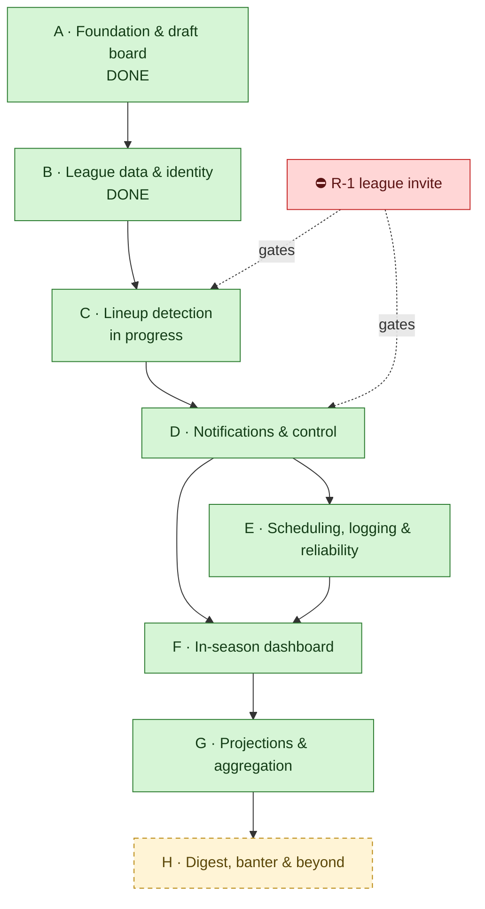

<!-- Generated/maintained by the `roadmap` skill. Edit via the skill to keep provenance + views consistent. -->
```yaml
# roadmap-config
milestone: V1
stages: [A, B, C, D, E, F, G, H]
tracks: [Alerts, UX, Data, Reliability, Setup]
id_scheme: stage-prefixed            # Stage A · Step A1 · Task A1.1
statuses: [Backlog, Next, In-progress, Blocked, Done, Hold]
priorities: [V1, V1-nice, Hold, "Won't-do"]
fields:
  required: [id, title, status, priority, provenance]
  optional: [target, depends_on, risk]
split_threshold: 8
```

# Fantasy Football Co-Coach — Roadmap & Planning Dashboard

> Single front door for "done / next / parked / blocking." Map here, detail in §9 links. Update §1 each session.

## 1. Status snapshot

| | |
|---|---|
| **Date** | 2026-08-31 |
| **Branch** | `review-fixes-truth-and-viability` · PR: — (7 merged) |
| **Tests** | 356 Python + 53 JS, all green · CI gates both on every PR |
| **Phase** | **Stage C complete (6/6)**, with C6 added by the 2026-08-31 review. Next is C7 (`CheckResult`), then Stage D |
| **V1 goal** | ✅ *A tool I actually want to use: I can see my team's situation at a glance, control what notifies me, trust the alerts I get, and diagnose it when it misbehaves.* |
| **Biggest blocker** | [R-1](#7-roadblocks) — no league invite yet (no league ID, no cookies) |

> **Note on the goal.** It is deliberately *not* "never miss a lineup fix." Lineup fixes matter but are
> not life-and-death; **user experience, notification control, and logging are first-class V1
> requirements**, not polish. This reordered the plan — the dashboard and notification control moved up
> from late phases, and observability moved up sharply from near-absent.

## 2. How this board works

Idea → tag in **§5** → fork? open **§6** decision → gates work? log **§7** roadblock → imminent? drill the Step to Tasks in `docs/roadmap/<stage>.md`.

- **Priority:** 🟢 V1 · 🔵 V1-nice · 🟡 Hold · ⚪ Won't-do.
- **Status:** Backlog → Next → In-progress → Blocked → Done (+ Hold).
- **Provenance (mandatory):** ✅ User-confirmed *(date)* · 🤖 Claude-proposed. No step runs without ≥1 ✅.
- **Hierarchy:** Stage `A` → Step `A1` → Task `A1.1` (tasks only for imminent work).
- **Ask for views:** "what needs my sign-off?", "V1 not-done", "what's blocked & why", "stage rollup", "critical path".

## 3. The workflow (mind-map)

### 3.1 Stage summary

**Legend:** 🟩 ✅ confirmed · 🟨 🤖 proposed · 🟥 ⛔ roadblock · ⬜ 🟡 hold.

### 3.2 Master plan — all steps

```mermaid
flowchart LR
    classDef confirmed fill:#d6f5d6,stroke:#2e7d32,color:#143d17;
    classDef proposed fill:#fff4d6,stroke:#b8860b,stroke-dasharray:5 4,color:#5b4708;
    classDef block fill:#ffd6d6,stroke:#c62828,color:#5b1414;
    classDef hold fill:#ededed,stroke:#888,color:#333;

    subgraph SA["A · Foundation"]
        direction TB
        A1["A1 config + cache"]:::confirmed
        A2["A2 ADP + player sources"]:::confirmed
        A3["A3 draft board UI"]:::confirmed
        A4["A4 CI"]:::confirmed
    end
    subgraph SB["B · League data"]
        direction TB
        B1["B1 ESPN adapter"]:::confirmed
        B2["B2 My League page"]:::confirmed
        B3["B3 identity crosswalk"]:::confirmed
        B4["B4 NFL schedule"]:::confirmed
    end
    subgraph SC["C · Lineup detection"]
        direction TB
        C1["C1 bye/OUT/IR advisor"]:::confirmed
        C2["C2 empty-slot defect"]:::confirmed
        C3["C3 week from ESPN"]:::confirmed
        C4["C4 action deadlines"]:::confirmed
        C5["C5 lineup-lock setting"]:::confirmed
    end
    subgraph SD["D · Notifications"]
        direction TB
        D1["D1 Notifier + channels"]:::confirmed
        D2["D2 message rendering"]:::confirmed
        D3["D3 quiet hours + 2-strike"]:::confirmed
        D4["D4 alert control config"]:::confirmed
        D5["D5 channel bake-off"]:::confirmed
    end
    subgraph SE["E · Reliability"]
        direction TB
        E1["E1 structured logging"]:::confirmed
        E2["E2 launchd install"]:::confirmed
        E3["E3 dead-man switch"]:::confirmed
        E4["E4 delivery failure"]:::confirmed
        E5["E5 ffcoach init"]:::confirmed
        E6["E6 inactives sweep"]:::confirmed
    end
    subgraph SF["F · Dashboard"]
        direction TB
        F0["F0 ffcoach serve"]:::confirmed
        F1["F1 week page"]:::confirmed
        F2["F2 notification control UI"]:::confirmed
        F3["F3 source refresh panel"]:::confirmed
        F4["F4 alert history view"]:::proposed
    end
    subgraph SG["G · Projections"]
        direction TB
        G1["G1 ESPN + Sleeper"]:::confirmed
        G2["G2 aggregation"]:::confirmed
        G3["G3 decision log"]:::confirmed
        G4["G4 bench upgrades"]:::confirmed
        G5["G5 model/scoring.py"]:::proposed
    end
    subgraph SH["H · Later"]
        direction TB
        H1["H1 digest + banter"]:::confirmed
        H2["H2 playoffs + elimination"]:::confirmed
        H3["H3 waivers"]:::proposed
        H4["H4 league intel"]:::proposed
        H5["H5 Vegas context"]:::hold
        H6["H6 multi-league"]:::hold
    end

    SA --> SB --> SC --> SD --> SE --> SF --> SG --> SH
    C3 -. gates .-> C4
    B4 -. gates .-> C1
    G2 -. gates .-> G4
    E1 -. gates .-> E3
    F0 -. gates .-> F2
```



### 3.3 Step registry

> Steps only — tasks live in stage docs. Confirming flips Provenance ✅ here **and** recolors 3.2.

| ID | Step | Status | Priority | Target | Depends-on | Risk | Key decisions / questions | Provenance |
|---|---|---|---|---|---|---|---|---|
| A1 | League config + SQLite cache | Done | 🟢 V1 | — | — | L | D-001 | ✅ 2026-08-20 |
| A2 | FFC ADP + Sleeper player sources | Done | 🟢 V1 | — | A1 | L | D-002 | ✅ 2026-08-20 |
| A3 | Draft board page + explain mode | Done | 🟢 V1 | — | A2 | L | D-003, D-004 | ✅ 2026-08-20 |
| A4 | GitHub Actions CI | Done | 🟢 V1 | — | — | L | — | ✅ 2026-08-28 |
| B1 | ESPN league adapter (cookie auth) | Done | 🟢 V1 | — | A1 | **H** | D-005, D-006 | ✅ 2026-08-28 |
| B2 | My League page + shared nav | Done | 🟢 V1 | — | B1 | L | D-007 | ✅ 2026-08-28 |
| B3 | Player identity crosswalk | Done | 🟢 V1 | — | A2 | M | D-008 | ✅ 2026-08-28 |
| B4 | NFL schedule (byes + kickoffs) | Done | 🟢 V1 | — | — | L | D-009 | ✅ 2026-08-29 |
| C1 | Lineup advisor: bye / OUT / IR | Done | 🟢 V1 | — | B1, B4 | L | D-010, D-011 | ✅ 2026-08-29 |
| C2 | Empty-slot detection | Done | 🟢 V1 | — | C1 | **H** | D-012 | ✅ 2026-08-29 |
| C3 | Current week from ESPN `scoringPeriodId` | Done | 🟢 V1 | — | B1 | M | D-013 | ✅ 2026-08-29 |
| C4 | Action-deadline alerting + bye look-ahead | Done | 🟢 V1 | — | C3 | M | D-014 | ✅ 2026-08-29 |
| C5 | Read lineup-lock league setting | Done | 🟢 V1 | — | B1 | M | D-015 | ✅ 2026-08-29 |
| C6 | **Truth repairs from the 2026-08-31 review** | Done | 🟢 V1 | — | C5 | M | D-044…D-048 | ✅ 2026-08-31 |
| C7 | **`CheckResult` + `ffcoach check --dry-run`** | Next | 🟢 V1 | Week 1 | C6 | M | D-049 | 🤖 |
| D1 | `Notifier` interface + **ntfy first** | Backlog | 🟢 V1 | Week 1 | C7 | M | D-016, D-042 | ✅ 2026-08-29 |
| D2 | Message rendering (160-char SMS budget) | Backlog | 🟢 V1 | Week 1 | D1 | L | D-017 | ✅ 2026-08-29 |
| D3 | Quiet hours + two-strike repeat policy | Backlog | 🟢 V1 | Week 1 | D1 | M | D-018, D-019 | ✅ 2026-08-29 |
| D4 | Per-alert enable / tier / threshold config | Backlog | 🟢 V1 | Week 1 | D1 | L | D-020 | ✅ 2026-08-29 |
| D5 | Channel bake-off (`notify --test`) | Backlog | 🔵 V1-nice | — | D1 | L | D-042 | ✅ 2026-08-29 |
| E1 | **Structured run logging** (JSONL + SQLite history) | Backlog | 🟢 V1 | Week 1 | D1 | M | D-021, D-041 | ✅ 2026-08-29 |
| E2 | `launchd` install + per-window scheduling | Backlog | 🟢 V1 | Week 1 | D1 | **H** | D-022 | ✅ 2026-08-29 |
| E3 | Dead-man's switch | Backlog | 🟢 V1 | Week 1 | E1, E2 | M | D-023 | ✅ 2026-08-29 |
| E4 | Delivery-failure detection + fallback | Backlog | 🟢 V1 | Week 1 | D1, E1 | M | D-024 | ✅ 2026-08-29 |
| E5 | `ffcoach init` + hardened `doctor` | Backlog | 🟢 V1 | Week 1 | D4 | M | D-025 | ✅ 2026-08-29 |
| E6 | Inactives sweep (~90m pre-kickoff) | Backlog | 🟢 V1 | Week 1 | E2 | M | D-026 | ✅ 2026-08-29 |
| F0 | **`ffcoach serve` — local web server** | Backlog | 🟢 V1 | — | — | L | D-040 | ✅ 2026-08-29 |
| F1 | Week dashboard (action queue + matchup strip) | Backlog | 🟢 V1 | — | C4, F0 | L | D-027, D-028 | ✅ 2026-08-29 |
| F2 | Notification control UI (writes config) | Backlog | 🟢 V1 | — | D4, F0 | M | D-020, D-040 | ✅ 2026-08-29 |
| F3 | Data-source refresh / health panel | Backlog | 🟢 V1 | — | E1, F0 | L | D-029 | ✅ 2026-08-29 |
| F4 | Alert history view | Backlog | 🔵 V1-nice | — | E1, F0 | L | — | 🤖 |
| G1 | ESPN + Sleeper projection sources (**two, not three**) | Backlog | 🔵 V1-nice | — | B3 | M | D-030, D-043 | ✅ 2026-08-29 |
| G2 | Aggregation + accuracy weighting | Backlog | 🔵 V1-nice | — | G1 | M | D-030 | ✅ 2026-08-29 |
| G3 | Decision log (projection + outcome) | Backlog | 🔵 V1-nice | — | G1 | M | D-031 | ✅ 2026-08-29 |
| G4 | Bench-upgrade alerts | Backlog | 🔵 V1-nice | — | G2 | M | D-032 | ✅ 2026-08-29 |
| G5 | `model/scoring.py` (custom scoring) | Backlog | 🟡 Hold | — | Q-2 | M | Q-2 | 🤖 |
| H1 | Tuesday digest + smack talk | Backlog | 🔵 V1-nice | — | D1 | L | D-033, D-034 | ✅ 2026-08-29 |
| H2 | Playoff weeks + elimination awareness | Backlog | 🔵 V1-nice | — | C3 | L | D-035 | ✅ 2026-08-29 |
| H3 | Waiver wire | Backlog | 🟡 Hold | — | G2 | M | — | ✅ 2026-08-29 |
| H4 | League-wide intelligence | Backlog | 🟡 Hold | — | B1 | M | D-036 | ✅ 2026-08-29 |
| H5 | Vegas game context | Hold | 🟡 Hold | Sept 2026 | — | M | D-037, Q-3 | ✅ 2026-08-29 |
| H6 | Multi-league support | Hold | 🟡 Hold | — | — | L | D-038 | ✅ 2026-08-29 |

**Stage rollup:** A 4/4 (100%) · B 4/4 (100%) · C 6/7 (86%) · D 0/5 · E 0/6 · F 0/5 · G 0/5 · H 0/6.
**Overall:** 14/42 steps done (33%).

> **On that percentage.** The 2026-08-31 review's sharpest line is that it overstates user
> value, because until C7 lands the finished lineup detection has no production caller —
> `find_problems()` appears exactly once in `src/`, at its own definition. Steps completed
> is a measure of code written, not of anything the user can run. Left as-is rather than
> re-weighted, with the caveat stated here instead.

## 4. Done ledger

| Shipped | Detail |
|---|---|
| **Draft board** (PR #1, #2) | Tiers, ADP value, availability-at-next-pick, explain mode, live localStorage recompute. |
| **ESPN league adapter** (PR #3) | Cookie auth, cache, `EspnAuthError`. Parser **still unverified against a live league** — see R-1. |
| **My League page** (PR #3) | Teams, records, rosters, starters vs bench. Shared `web/nav.js` so new sections cost one entry. |
| **CI** (PR #3) | `pytest` + `node --test` on every PR. Nothing gated builds before this. |
| **Identity crosswalk** (PR #4) | 240/240 draftable players carry ESPN/MFL/GSIS ids. Absorbed the `"NA"` sentinel and `merge_name` alias traps. |
| **NFL schedule** | Byes derived (32/32 teams), 6 lock windows/week measured. Caught the `LA`/`LAR` + `WAS`/`WSH` mismatch that would have silently killed bye alerts for two teams. |
| **Lineup advisor** | Bye/OUT/IR detection with eligible-replacement naming. QUESTIONABLE deliberately excluded. |
| **Action deadlines** (C4) | Deadline follows the available fix, not kickoff. Waiver timing read from ESPN (six days/wk at 11:00 — the Wednesday assumption was wrong). Bye look-ahead flags next week's uncovered byes while claims still help. |
| **Week resolution** (C3) | ESPN `scoringPeriodId` is authoritative and short-circuits before any schedule fetch; derivation is fallback-only and self-labels. Refuses rather than defaulting when neither is available. |
| **Empty-slot detection** (C2) | Closed a correctness hole: an empty starting slot had no roster entry to iterate, so the most elementary lineup failure was invisible. Slot counts come from ESPN `lineupSlotCounts`. Fixture proof: 1 finding before, 6 after. |

## 5. Feature / work backlog

> Steps live in §3.3. This holds ideas not yet promoted to Steps.

| ID | Item | Why / angle | Priority | Track | Status | Provenance |
|---|---|---|---|---|---|---|
| X-1 | IR-slot management prompts | Moving an IR-eligible player to IR frees a bench spot — a real move nobody surfaces | 🔵 V1-nice | Alerts | Backlog | 🤖 |
| X-2 | Trade-deadline reminder | Fixed league date; easy to forget | 🔵 V1-nice | Alerts | Backlog | 🤖 |
| X-3 | Drop-candidate naming on waiver advice | "Claim Pittman" is incomplete when the roster is full | 🔵 V1-nice | Alerts | Backlog | ✅ 2026-08-29 |
| X-4 | Side-by-side player comparison | Table stakes in competing tools; cheap once projections exist | 🔵 V1-nice | UX | Backlog | 🤖 |
| X-5 | Accuracy-weighted source ranking display | Show *which* source has been right this season | 🔵 V1-nice | UX | Backlog | 🤖 |
| X-6 | Remove `clangd-lsp` plugin | C/C++ language server, irrelevant to this Python/JS repo | ⚪ Won't-do | — | Backlog | 🤖 |

## 6. Decision Log

### Decided

- **D-001 — Deterministic Python core + Claude skill.** ✅ *(2026-08-20)*. "Same every time = script; needs judgment = skill." Advisors emit structured findings, never prose.
- **D-002 — Free data only.** ✅ *(2026-08-20)*. No paid projection feeds, ever.
- **D-003 — Never rename standard terminology.** ✅ *(2026-08-20)*. Interface says "ADP", not "Typical pick". Terms are annotated, never replaced. Enforced by tests.
- **D-004 — Explain mode annotates only.** ✅ *(2026-08-20)*. Toggling never changes layout or ordering.
- **D-005 — Platform is ESPN, permanently.** ✅ *(2026-08-28)*. No other platform will be supported.
- **D-006 — Keep `LeagueAdapter` despite one implementation.** ✅ *(2026-08-29)*. Justified as the test seam for injecting fixture rosters without HTTP — *not* platform flexibility.
- **D-007 — Shared nav from one `PAGES` list.** ✅ *(2026-08-28)*. New sections cost one entry, not per-page markup.
- **D-008 — Resolve identity by ID before matching.** ✅ *(2026-08-28)*. Name matching already failed twice (accents, nicknames).
- **D-009 — Alerts time off per-player kickoff, not a weekly sweep.** ✅ *(2026-08-29)*. Measured: 6 distinct lock windows in Week 8.
- **D-010 — QUESTIONABLE/DOUBTFUL are not "out".** ✅ *(2026-08-29)*. Uncertain; handled by the inactives sweep instead.
- **D-011 — Locked findings are reported, never dropped.** ✅ *(2026-08-29)*. Silently discarding makes a missed player look like a clean lineup.
- **D-012 — Empty slots carry the same severity as OUT.** ✅ *(2026-08-29)*.
- **D-013 — Week comes from ESPN `scoringPeriodId`.** ✅ *(2026-08-29)*. Computing it means owning the rollover moment; a rollover bug alerts about the wrong week entirely.
- **D-014 — Alert on the earliest deadline that permits the fix.** ✅ *(2026-08-29)*. No bench replacement ⇒ needs a waiver claim ⇒ Tuesday deadline, not Sunday kickoff.
- **D-015 — Read the lineup-lock setting rather than assume per-player.** ✅ *(2026-08-29)*.
- **D-016 — Two tiers: interrupt (push/SMS) vs digest (email).** ✅ *(2026-08-29)*. Zero interrupts in a clean week is the system working.
- **D-017 — Batched per lock window, with reasons, under 160 chars.** ✅ *(2026-08-29)*.
- **D-018 — Quiet hours 23:00–08:00 ET, deferred not dropped.** ✅ *(2026-08-29)*.
- **D-019 — Two-strike repeat policy; the roster is the acknowledgment.** ✅ *(2026-08-29)*. No inbound channel needed — a fixed problem stops being a finding on its own.
- **D-020 — Notifications must be user-controllable.** ✅ *(2026-08-29)*. Per-alert enable/tier/threshold, editable from the UI. A V1 requirement, not polish.
- **D-021 — Logging is a V1 requirement.** ✅ *(2026-08-29)*. Needed to diagnose failures; was near-absent in the original design.
- **D-022 — `launchd`, not `cron`.** ✅ *(2026-08-29)*. cron does not run missed jobs on a sleeping Mac — it would appear to work and fail silently on the mornings that matter.
- **D-023 — Dead-man's switch.** ✅ *(2026-08-29)*. Expired cookies produce no alert, indistinguishable from "nothing wrong."
- **D-024 — Delivery failure is distinct from check failure.** ✅ *(2026-08-29)*.
- **D-025 — Must be clonable by someone else.** ✅ *(2026-08-29)*. `ffcoach init` + hardened `doctor`; no personal data in the repo.
- **D-026 — Inactives sweep ~90m before kickoff.** ✅ *(2026-08-29)*. The highest-value alert: a Questionable starter ruled out while you're at brunch.
- **D-027 — Action queue on top, matchup as a persistent strip.** ✅ *(2026-08-29)*. Chosen from browser mockups.
- **D-028 — No automated lineup changes.** ✅ *(2026-08-29)*. ESPN has no write API; reverse-engineering one risks the account to save two taps. Text instructions + collapsible ESPN how-to.
- **D-029 — Rounded scores with the source named.** ✅ *(2026-08-29)*. Decimals imply precision ESPN's projections lack.
- **D-030 — Aggregate 3+ projection sources, weighted by accuracy.** ✅ *(2026-08-29)*. 12-season study: aggregation beat every individual source in 69% of comparisons; ESPN now ranks last.
- **D-031 — Full decision log (source accuracy + own decisions).** ✅ *(2026-08-29)*.
- **D-032 — Bench upgrades never interrupt by default; gated behind aggregation.** ✅ *(2026-08-29)*. A wolf-crying channel is the same channel carrying "your starter is on bye."
- **D-033 — Banter as written, copy-paste-ready lines.** ✅ *(2026-08-29)*.
- **D-034 — Banter targets decisions and outcomes, never people.** ✅ *(2026-08-29)*.
- **D-035 — Playoffs: flag Week 18 resting + elimination awareness.** ✅ *(2026-08-29)*.
- **D-036 — League intel deferred, not rejected.** ✅ *(2026-08-29)*. Highest differentiation available; revisit after alerts are proven.
- **D-037 — Vegas context parked until the season starts.** ✅ *(2026-08-29)*. See Q-3 for the exact re-check.
- **D-038 — One league now; don't hardcode against a second.** ✅ *(2026-08-29)*.
- **D-039 — Feature branches + PRs into `main`, never direct merge.** ✅ *(2026-08-28)*.
- **D-040 — `ffcoach serve`: a small local web server.** ✅ *(2026-08-29)*. Python stdlib only, localhost, no new dependency. Two things forced it: requiring VS Code Live Server is real friction for a tool checked weekly, and **notification control (F2) is impossible as static HTML** — a page cannot write your config file. Replaces the Live Server workflow.
- **D-041 — Logging is structured JSONL plus SQLite history.** ✅ *(2026-08-29)*. Every run appends a JSON line (checked / found / sent / failed); alert and decision history go in the existing SQLite cache. Greppable at 9am on a Sunday, queryable by the UI history view, and one storage decision covers both E1 and G3.
- **D-042 — ntfy is the first channel built.** ✅ *(2026-08-29)*. Closes Q-1. No credentials, no carrier dependency, no length ceiling — the fastest path to a working alert. Email and SMS gateway remain behind the same interface for later; the bake-off (D5) drops to V1-nice.
- **D-043 — Ship two projection sources, add a third later.** ✅ *(2026-08-29)*. Closes Q-5. ESPN and Sleeper are both confirmed free and unauthenticated, and a two-source average already beats either alone. Unblocks G1/G2 now instead of waiting on nflverse-derived modeling work.
- **D-044 — Sources return `SourceResult`, and parse before they cache.** ✅ *(2026-08-31)*. From the review. Bare text made a live fetch and a week-old cache indistinguishable, and caching a raw 200 before validating it let an ESPN login page evict the last usable roster. Freshness now travels with the value (the `WeekResolution` / `LineupLock` idiom applied a third time), and `freshest()` reports a page's age as its *oldest* input. **Amends the source template in CLAUDE.md.**
- **D-045 — Replacements are allocated across the roster, not chosen per slot.** ✅ *(2026-08-31)*. From the review, confirming a suspicion already recorded in `CODEX_README.md`. `advisors/roster_plan.py` serves the most-constrained opening first so a dedicated RB slot is not stripped by FLEX. IR is a prerequisite action, not a bench swap — ESPN will not start a player out of an IR slot.
- **D-046 — Deadlines carry a fix *kind*, not just a time. Partially overturns D-014's implementation.** ✅ *(2026-08-31)*. The review is right and the C5 clamp was wrong. `min(waiver, lock)` stopped the number from printing after the lock but kept saying "claim someone", producing a plausible time attached to an impossible action. `FixPlan` names the action (`BENCH_SWAP` / `WAIVER_CLAIM` / `ADD_BEFORE_LOCK` / `UNKNOWN`) with a one-word verb. **D-014's principle stands** — the deadline belongs to the available fix — only the clamp is replaced. Deliberately no `FREE_AGENT_ADD`: nothing fetches the free-agent pool, and an unemittable kind is a lie.
- **D-047 — An unusable value becomes `UNKNOWN` plus a diagnostic; a plausible default is never substituted.** ✅ *(2026-08-31)*. From the review. Unknown ESPN slot ids defaulted to `BN` (hiding a real starter from every check) and unknown pro teams to `FA` (matching no schedule row, so he looked safe). Both produced a clean run and an unguarded lineup. Diagnostics travel on `League.diagnostics` into the payload and onto the page, because a warning only on stderr of an unattended run is not a warning.
- **D-048 — Missing schedule data is `unknown`, never `bye`.** ✅ *(2026-08-31)*. From the review, then widened. A row with a blank kickoff time was dropped, after which "no row" meant bye — a TBD game became the most certain fact the product emits. `Schedule.status()` is now tri-state, **and** a bye additionally requires being the team's *single* missing week, so a truncated download cannot manufacture a run of byes. That second half is not in the review; the same defect generalizes past the case it found.
- **D-049 — Compose detection into a `CheckResult` before building delivery (C7).** ✅ *(2026-08-31)*. From the review, accepted in narrow form. `find_problems()` has no production caller, so there is currently nothing for a notifier to send and no place orchestration lives except inside a delivery module. C7 adds that object and `ffcoach check --dry-run`. **Not accepted:** the review's broader reordering of D/E/F around it — see the reply document for why the evidence does not carry that far.

### Open — need a decision

- **Q-2 — Does the league use custom scoring?** 🟡 OPEN · 🤖 · *blocked by R-1*. If yes, `model/scoring.py` (G5) becomes required rather than Hold. ESPN's `mSettings` may answer it automatically once the invite lands. *Affects: G5, G1.*
- **Q-3 — Does ESPN publish odds for free in-season?** 🟡 OPEN · 🤖 · *blocked until Sept 2026*. Re-check during a real game week: call `site.api.espn.com/apis/site/v2/sports/football/nfl/scoreboard` and inspect `events[].competitions[0].odds`. Populated ⇒ Vegas context is zero-setup and H5 should be built. Empty ⇒ decide whether an optional API key is acceptable. *Affects: H5.*
- **Q-4 — Carrier**, only if the SMS gateway is ever built. 🟡 OPEN · 🤖 · *deferred by D-042* — ntfy needs no carrier, so this no longer blocks anything. *Affects: D1.*
- **Q-6 — What is the third projection source, eventually?** 🟡 OPEN · 🤖 · *not blocking*. D-043 ships two now. A third is most likely *derived* from nflverse rather than fetched — real modeling work, not another adapter. *Affects: G1, G2.*

## 7. Roadblocks

- **R-1 — No league invite yet.** *Gates:* verifying the ESPN parser against real data; `espn.yaml`; real league settings; anything running against a live league. **No longer gates C5** — C5 was unblocked by recognizing only the *default* lock value and treating any other as the alternative, so the unverified spelling was never needed. *What must change:* the user is invited and supplies league ID + `espn_s2`/`SWID` cookies. *Why it matters:* `leagues/espn.py` was built against a **hand-written fixture** derived from community docs — tests passing proves internal consistency, **not** that it matches ESPN. Expect field-name corrections. *Who decides:* league commissioner, then user. *Linked:* B1, Q-2.
- **R-2 — `launchd` correctness is untestable in CI.** *Gates:* confidence in E2/E3. *What must change:* a real install-and-wait-a-day check on the actual iMac. *Why:* the failure mode is silence, which looks identical to success. *Who decides:* user (manual verification). *Linked:* E2, E3.
- **R-3 — The scheduler and the dead-man's switch share one sleeping iMac.** *(Raised by the 2026-08-31 review.)* *Gates:* whether "never miss a move" is literally true or best-effort. *Why:* a process on that machine cannot warn you while the machine is asleep. Running a missed job on wake only helps if wake precedes the deadline. *What must change:* either an off-host heartbeat, or the promise is restated as best-effort in the product's own copy. *Who decides:* user. *Linked:* E2, E3, D-023.

## 8. Validation & test-coverage status

| Layer | State |
|---|---|
| Unit/integration | 356 Python + 53 JS, all green; offline via committed fixtures |
| Coverage % | Unmeasured — no coverage tooling configured |
| Live-data verification | Crosswalk ✅ (240/240), schedule ✅ (32/32 byes), **ESPN league parser ❌ (fixture only — R-1)** |
| Build/packaging | `uv` + hatchling; console script `ffcoach`; CI green on every PR |
| Manual/operational | **None yet** — `launchd`, delivery, and quiet hours are all untested in the real world |

## 9. Source-doc index

| Doc | Role |
|---|---|
| `docs/superpowers/specs/2026-08-20-fantasy-football-co-coach-design.md` | Original design authority — draft board, data layer, UX rules |
| `docs/superpowers/specs/2026-08-29-in-season-alerting-design.md` | In-season alerting design (revised twice); supersedes the 2026-08-20 notification + phasing sections |
| `docs/roadmap/C.md` | **Stage C task detail** — the imminent stage, drilled to tasks |
| `docs/superpowers/plans/2026-08-20-phase-1-draft-strategy.md` | Executed plan for Stage A — historical |
| `CLAUDE.md` | Agent instructions: source-module template, crosswalk traps, test-enforced UX rules |
| `README.md` | Setup and usage |
